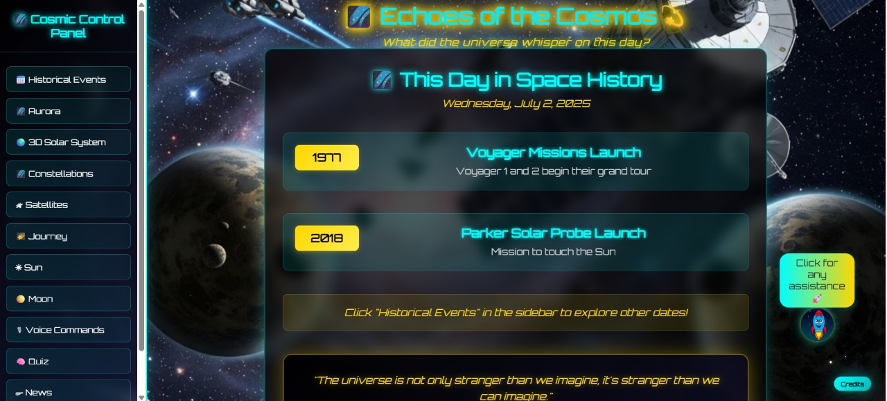
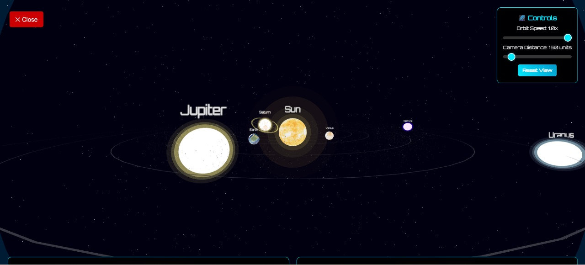
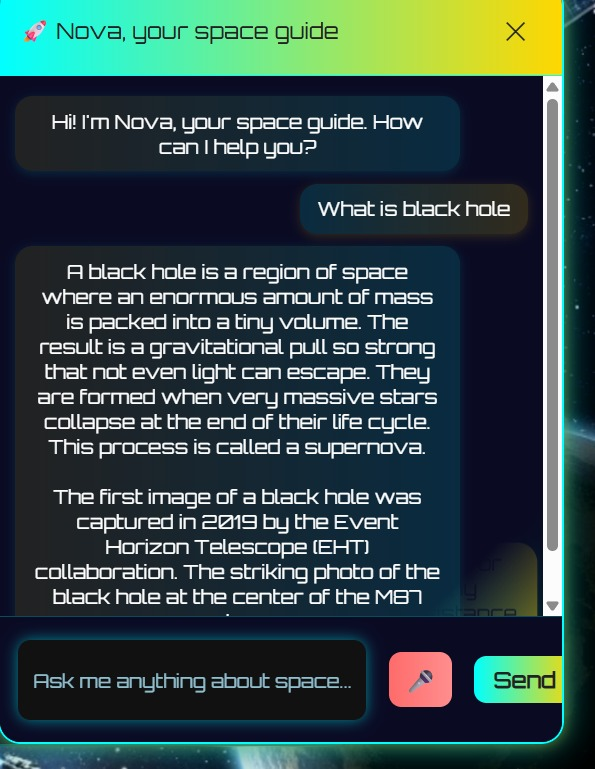

# Echoes of the Cosmos 🌌

## 🚀 Project Overview
Echoes of the Cosmos is an interactive, educational web platform designed to make space exploration fun and accessible for everyone. It combines real scientific data, beautiful visuals, and AI-powered features to create an immersive cosmic experience.

## ✨ Key Features
- 🛰️ **Cosmic Control Panel** – Sidebar navigation to explore different space topics and tools.
- 🌌 **3D Solar System** – Realistic, interactive 3D model of the solar system with detailed planet info, textures, and orbits.
- 📅 **Historical Events & Space Facts** – Learn about important space missions, scientific facts, and cosmic history.
- 🌠 **Aurora & Space Videos** – Stunning aurora and planetary videos/images for a visually rich experience.
- 🤖 **AI Chatbot (Nova)** – Ask any space-related question and get instant, AI-powered answers.
- 📡 **Satellite & Constellation Data** – Explore satellite launches and constellation maps.
- 🎙️ **Voice Commands & Speech Synthesis** – Control the site and get information using your voice.
- 🌞 **Sun & Moon Data** – Get real-time scientific and educational information about the Sun and Moon.
- 🧠 **Cosmic Quiz** – Test your knowledge with a fun, space-themed quiz.
- 📰 **Space News Ticker** – Stay updated with the latest news in space exploration.
- 📚 **Educational Content** – All data is sourced from public APIs (NASA, Launch Library, etc.) and curated for learning.
- 🎨 **Modern, Cosmic Design** – Beautiful, animated UI with cosmic themes, emojis, and smooth navigation.

## 🛠️ How to Run Locally

### 1. Download the Project
- Go to the GitHub repository:
  👉 https://github.com/IshaanSaxena2005/Echoes-of-the-Cosmos
- Click the green "Code" button → choose "Download ZIP".
- Extract the ZIP file to a folder on your computer.

---

### 🖥️ Step 2: Start a Local Server
> **Opening the project by double-clicking `index.html` will break key features like:**
> - ❌ 3D planets and their textures won't load
> - ❌ Videos, backgrounds, or animations may not play
>
> **To fix this, run a local server using one of the options below:**

#### ✅ Option 1: Using Python (Beginner Friendly)
1. Open the folder where you extracted the ZIP file.
2. In the address bar of that folder, type `cmd` and press Enter.
   → This will open the Command Prompt in that folder.
3. Now type this command and press Enter:
   ```
   python -m http.server 8000
   ```
4. Open your browser and go to:
   👉 http://localhost:8000

#### ✅ Option 2: Using VS Code (If installed)
1. Open Visual Studio Code
2. Install the Live Server extension
3. Open the project folder
4. Right-click `index.html` → choose "Open with Live Server"

#### ✅ Option 3: Using Node.js (Advanced Users)
1. Install Node.js from https://nodejs.org
2. Open the terminal and run:
   ```
   npm install -g http-server
   http-server -p 8000
   ```
3. Open browser and visit:
   👉 http://localhost:8000

---

### 🎉 Step 3: Explore the Universe
Now your site will work with:
- ✅ 3D planets and cosmic animations
- ✅ Full audio/video experience
- ✅ AI chatbot and interactive tools

## 👨‍🚀 Creators
- 🛠️ **Ishaan Saxena** – Core Developer | Feature Integrator | Logic Builder | UI Specialist
- 🎨 **Harpreet Singh** – Creative Director | Concept Architect | Prompt Engineer

## 🖼️ Screenshots

1. **Home Page View**  
A glimpse of the beautifully designed cosmic homepage.  


2. **3D Solar System View**  
Explore interactive planets, their textures, and orbits in real-time.  


3. **AI Chatbot – Nova**  
Nova, your intelligent space assistant, answers your space-related queries using voice/text.  


## 🏆 Submission Note
This project was built for the AstralWeb SRM Innovate 2025 competition. It aims to blend innovation, education, and user experience in a fun, futuristic way.

