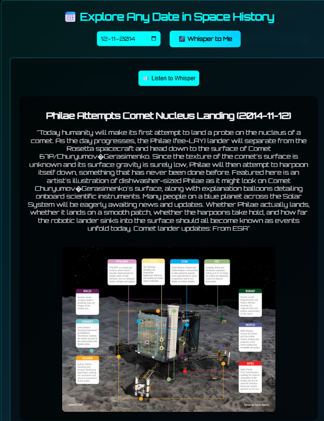

# Echoes of the Cosmos 🌌


Echoes of the Cosmos is an interactive web platform designed to make space exploration engaging and educational.  
It combines **3D visualization, scientific APIs, AI assistance and voice interaction** to create an immersive cosmic learning experience.

---

## 🚀 Live Demo

https://echoes-of-the-cosmos-1.onrender.com/

---

## 📸 Screenshots

### Historical Events



### 3D Solar System


### AI Chatbot – Nova


---

## ✨ Features

- 🌌 **Interactive 3D Solar System** with realistic planet visualization
- 📅 **Historical Space Events** and cosmic facts
- 📡 **Satellite & Constellation Data**
- 🌠 **Aurora & Space Media Viewer**
- ☀ **Sun & Moon Scientific Data**
- 🎙 **Voice Commands & Speech Synthesis**
- 🤖 **AI Chatbot – Nova** for answering space questions
- 🧠 **Cosmic Quiz** to test knowledge
- 📰 **Space News Ticker**
- 🎨 **Animated Cosmic UI with modern design**

---

## 🛠 Tech Stack

- **HTML5**
- **CSS3**
- **JavaScript**
- **Three.js** (3D Solar System)
- **Web Speech API** (Voice commands & speech synthesis)
- **Cohere API** (AI chatbot)
- **NASA APIs**
- **Launch Library API**

---

## 🧠 Skills Demonstrated

- 3D visualization with Three.js
- API integration with external data sources
- Voice interaction using Web Speech API
- Frontend application architecture
- Interactive UI/UX design
- Real-time data visualization

---

## 🛠️ How to Run Locally

### 1. Download the Project

- Go to the GitHub repository:
  👉 https://github.com/IshaanSaxena2005/Echoes-of-the-Cosmos
- Click the green "Code" button → choose "Download ZIP".
- Extract the ZIP file to a folder on your computer.

---

### 🖥️ Step 2: Start a Local Server

> **Opening the project by double-clicking `index.html` will break key features like:**
>
> - ❌ 3D planets and their textures won't load
> - ❌ Videos, backgrounds, or animations may not play
>
> **To fix this, run a local server using one of the options below:**

#### ✅ Option 1: Using Python (Beginner Friendly)

1. Open the folder where you extracted the ZIP file.
2. In the address bar of that folder, type `cmd` and press Enter.
   → This will open the Command Prompt in that folder.
3. Now type this command and press Enter:
   ```
   python -m http.server 8000
   ```
4. Open your browser and go to:
   👉 http://localhost:8000

#### ✅ Option 2: Using VS Code (If installed)

1. Open Visual Studio Code
2. Install the Live Server extension
3. Open the project folder
4. Right-click `index.html` → choose "Open with Live Server"

#### ✅ Option 3: Using Node.js (Advanced Users)

1. Install Node.js from https://nodejs.org
2. Open the terminal and run:
   ```
   npm install -g http-server
   http-server -p 8000
   ```
3. Open browser and visit:
   👉 http://localhost:8000

---

### 🎉 Step 3: Explore the Universe

Now your site will work with:

- ✅ 3D planets and cosmic animations
- ✅ Full audio/video experience
- ✅ AI chatbot and interactive tools

## 👨‍🚀 Creators

- 🛠️ **Ishaan Saxena** – Core Developer | Feature Integrator | Logic Builder | UI Specialist
- 🎨 **Harpreet Singh** – Creative Director | Concept Architect | Prompt Engineer

## 🏆 Submission Note

This project was built for the AstralWeb SRM Innovate 2025 competition. It aims to blend innovation, education, and user experience in a fun, futuristic way.
